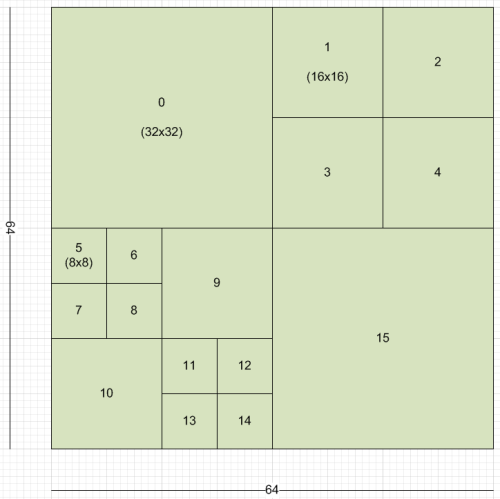
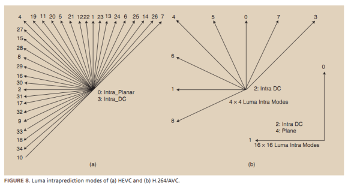

# Picture Partition

* O H.265 ampliou limite do macrobloco de 16x16 para 64x64

> Os limites do bloco foram ampliados tanto para o máximo quanto para o mínimo. Com limites maiores podemos 
> codificar sinais estacionários (com baixa frequência) de 
> forma mais eficiente, enquanto as subdivisões de até 4x4 melhor codificam sinais de mais alta frequência.

---

# Transformação

 * Para a transformação de blocos pequenos foi visto que o uso de DST (Discrete Sine Transformation) tem um deesempenho superior ao DCT.
 
> A DST se ajusta melhor a frequências mais altas e por > isso é preferível para blocos 4x4 utilizados para regiões de maior detalhamento.

---

# Predição Intra

* A predição intra foi atualizada de 9 modos no AVC para 35 modos no HEVC.

> Com o aumento no número de direções para as predições podemos predizer os pixels de forma mais eficiente

