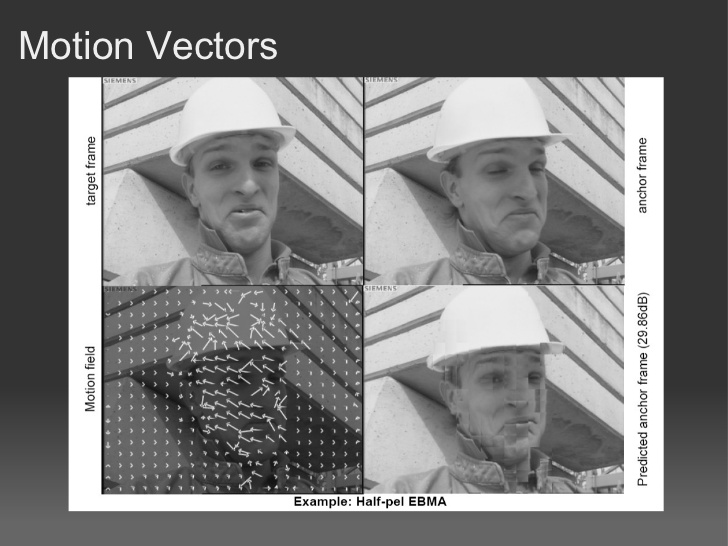
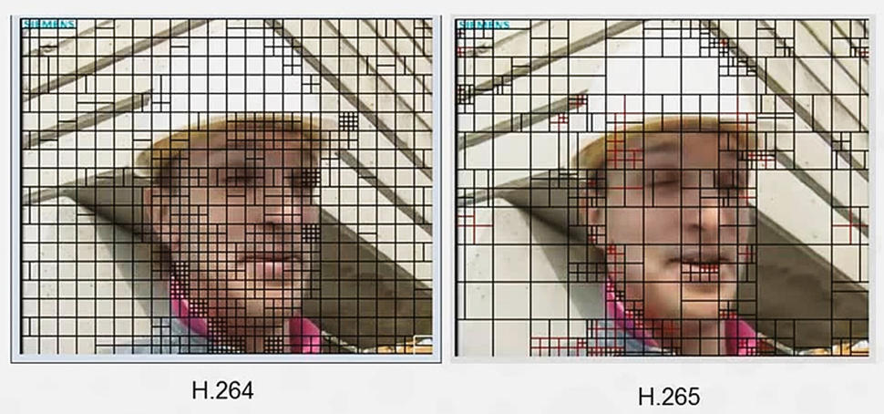

# H.265 - Codificação Aritmética Adaptativa

----

# Codificação com Perda

    

 "Quantização";
    "Quantização" -> "Condificação de Entropia";
    node [shape=box,style=filled,color=".7 .3 1.0"];
    "Transformada" -> "Compactar a energia" [style=dotted] ;
    "Quantização" -> Qualidade [style=dotted];
  }
'/>

-----

# Motion Vector - H264

[h-264 in cuda presentation](http://pt.slideshare.net/ashoknaik120/h-264-in-cuda-presentation)
-----

# Motion Vector - H265

[cnet.com](http://www.cnet.com/news/what-is-hevc-high-efficiency-video-coding-h-265-and-4k-compression-explained/)

----

# Diferenças

- Motion Compensated Prediction $16\times16 \rightarrow 64\times64$.

- Predição de blocos de tamanhos distintos, tendo blocos de tamanho residual até $32\times32$.

- Motion Vector $9 \rightarrow 35$ intra-picture directions.

- Adaptive Motion Vector Prediction (data do bloco e seus vizinhos).

- Sample Adaptive Offset (reduz artefatos nas bordas dos blocos).