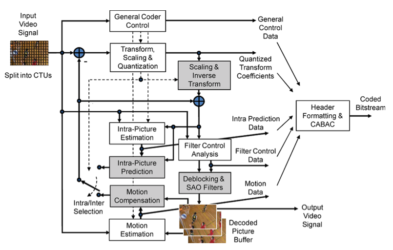
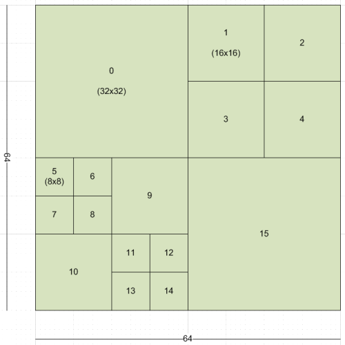
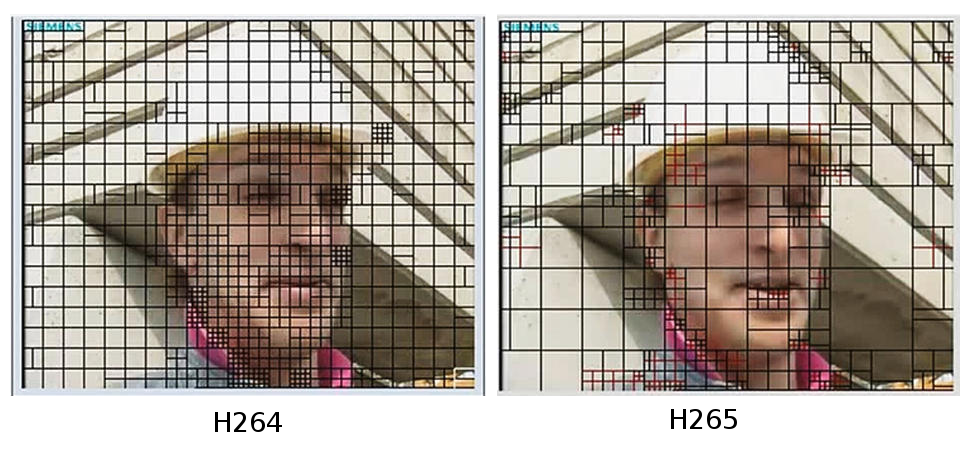
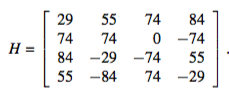
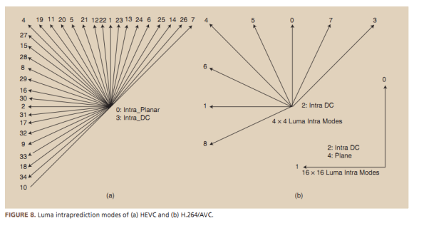
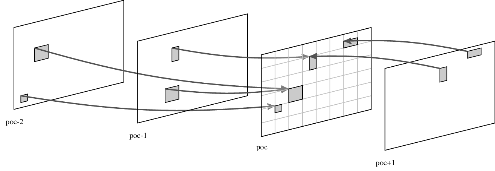
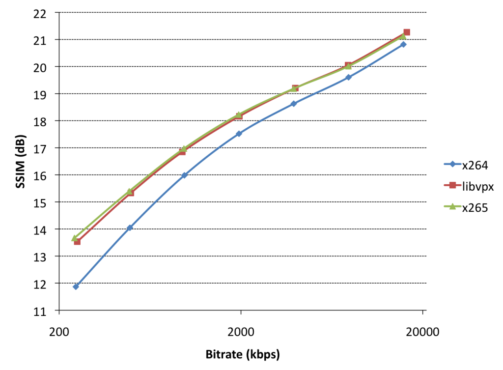

# H.265/HEVC

----

# HEVC

* Basicamente o HEVC irá funcionar como outros codificadores de vídeo.
* As principais mudanças que fizeram com que o HEVC se torna-se um ótimo codificador serão destacadas em nossa apresentação.

---

# Principais diferenças com H.264

* Motion Compensated Prediction 16×16→64×64.

* Predição de blocos de tamanhos distintos, tendo blocos de tamanho residual até 32×32.

* Motion Vector 9→35 intra-picture directions.

* Adaptive Motion Vector Prediction (data do bloco e seus vizinhos).

* Sample Adaptive Offset (reduz artefatos nas bordas dos blocos).

---

# Partição

* O H.265 ampliou limite do macrobloco de 16x16 para 64x64

# presenter notes

Os limites do bloco foram ampliados tanto para o máximo quanto para o mínimo. Com limites maiores podemos 
codificar sinais estacionários (com baixa frequência) de 
forma mais eficiente, enquanto as subdivisões de até 4x4 melhor codificam sinais de mais alta frequência.

---

# Partição

# presenter notes

Podemos notar que nas regiões de maior detalhamento, como na boca e nas orelhas, o codificador utilizou partições menores para melhor representar estas partes e com isso ganhar na predição com vertores de movimento.

---

# Transformação

 * Para a transformação de blocos pequenos foi visto que o uso de DST (Discrete Sine Transformation) tem um deesempenho superior ao DCT.
 * A matriz **H** é a matriz de transformação utilizada para os blocos 4x4 

<!--  -->
   
$$M=
  \begin{bmatrix}
    39 & 55 & 74 & 84 \newline
    74 & 74 & 0 & -74 \newline
    84 & -29 & -74 & 55 \newline
    55 & -84 & 74 & -29
  \end{bmatrix}
 $$

# presenter notes
 
A DST se ajusta melhor a frequências mais altas e por isso é preferível para blocos 4x4 utilizados para regiões de maior detalhamento. O uso da DST não é muito mais exigente computacionalmente que a DCT nos blocos 4x4 e o uso da DST acarreta em uma melhora de 1% no bit rate da imagem.

---

# Predição Intra

* A predição intra foi atualizada de 9 modos no AVC para 35 modos no HEVC.

# presenter notes

 Com o aumento no número de direções para as predições podemos predizer os pixels de forma mais eficiente
 
 ---
 
# Predição Inter

* No HEVC temos dois modos de predição :

	- Merge.
	- Advanced MV (*novo*).

# presenter notes

 - O Advanced MV cria uma lista de candidatos para os vetores de movimento usando um modelo porbabilístico mais complexo. Após a criação da lista os melhores candidatos são indexados com o MV Delta, o vetor com a diferença entre o movimento verdadeiro e a predição. O modo Merge é parecido, porém os candidatos são calculados com base nos index vizinhos.
 
 ---
 
# Comparação VP9/AVC/HEVC

* Podemos ver uma melhora significativa entre o x254(AVC) e o x265(HEVC)

# presenter notes

  A melhora no HEVC não foi presente somente nos vídeos de alta definição. Também podemos ver que vídeos com baixos bitrates também possuem uma grande melhora. 
